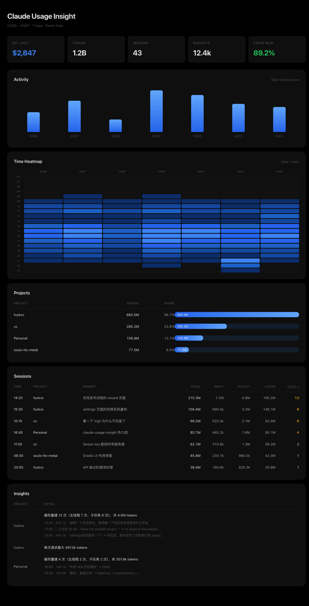

# Claude Usage Insight

**[中文版](README_CN.md)**

A local analytics tool for Claude Code usage data. Generates HTML reports from `~/.claude` data — no API calls, no data leaves your machine.

 



## What it does

- Scans `~/.claude/projects/**/*.jsonl` for token usage per request
- Aggregates by project, session, hour, and model
- Calculates estimated API cost per model (Opus/Sonnet/Haiku pricing)
- Detects cold starts (cache rebuilds) and flags high-cost sessions
- Generates a dark-themed HTML report with:
  - Summary cards (cost, tokens, sessions, cache hit rate)
  - Activity chart (hourly for single day, daily for multi-day)
  - Activity Pattern heatmap (date x hour, multi-day only)
  - Project breakdown with bar visualization
  - Session list with token breakdown (input/output/cache/cold starts)
  - Insights table (cold start details + max request analysis)

## Quick Start

### As a Claude Code Skill

Copy to your skills directory:

```bash
cp -r claude-usage-insight ~/.claude/skills/
```

Then invoke in Claude Code:

```
/claude-usage-insight
```

### Standalone CLI

```bash
# Today's report (auto-opens in browser on macOS)
python3 scripts/claude_usage_insight.py report --preset today

# Last 7 days
python3 scripts/claude_usage_insight.py report --last 7d

# Last 30 days
python3 scripts/claude_usage_insight.py report --preset last-30d

# Custom date range
python3 scripts/claude_usage_insight.py report --since 2026-03-01 --until 2026-03-31

# Text summary (no HTML)
python3 scripts/claude_usage_insight.py summary --preset today

# Top projects by tokens
python3 scripts/claude_usage_insight.py top --by project --last 7d
```

## Time Ranges

| Preset | Description |
|--------|-------------|
| `today` | Current day (default) |
| `yesterday` | Previous day |
| `last-7d` | Last 7 days |
| `last-30d` | Last 30 days |
| `this-month` | Current month |
| `last-month` | Previous month |

Custom: `--since YYYY-MM-DD --until YYYY-MM-DD` or `--last 24h|72h|7d`

## Report Features

### Single Day
- Hourly activity bar chart with hover tooltips
- All 24 hours displayed

### Multi-Day
- Daily bar chart
- Activity Pattern: GitHub-style contribution graph (date x hour grid, 6-level color scale)

### Always Present
- **Stats cards**: Est. Cost, Total Tokens, Sessions, Requests, Cache Read %
- **Projects**: Token volume + share + bar chart
- **Sessions**: Top 30 by token volume with date/time, project, prompt, input/output/cache breakdown, cold start count
- **Insights**: Per-session analysis — cold start details (count, main/subagent split, cost, timeline) and max request token breakdown (Cache Write / Cache Read / Input / Output)

## Pricing Model

Estimated cost is calculated per-request using the actual model:

| Model | Input | Output | Cache Write | Cache Read |
|-------|-------|--------|-------------|------------|
| Opus 4.6 | $5/M | $25/M | $6.25/M | $0.50/M |
| Sonnet 4.6 | $3/M | $15/M | $3.75/M | $0.30/M |
| Haiku 4.5 | $1/M | $5/M | $1.25/M | $0.10/M |

This is "what it would cost via API" — not your actual bill if you're on Claude Max subscription.

## File Naming

Reports are written to `~/.claude/usage-data/reports/` with idempotent names:

- `claude-usage-today.html`
- `claude-usage-yesterday.html`
- `claude-usage-last-7d.html`
- `claude-usage-2026-03-01_to_2026-03-31.html`

Re-running the same range overwrites the file. No timestamp suffix, no pileup.

## Data Sources

| Source | What |
|--------|------|
| `~/.claude/projects/**/*.jsonl` | Request-level token usage |
| `~/.claude/usage-data/session-meta/*.json` | Session metadata, tool counts |
| `~/.claude/usage-data/facets/*.json` | Semantic labels (goals, outcomes) |
| `~/.claude/history.jsonl` | First prompt text (fallback) |

## Requirements

- Python 3.9+
- No external dependencies (stdlib only)
- macOS: auto-opens HTML report in browser

## License

MIT
